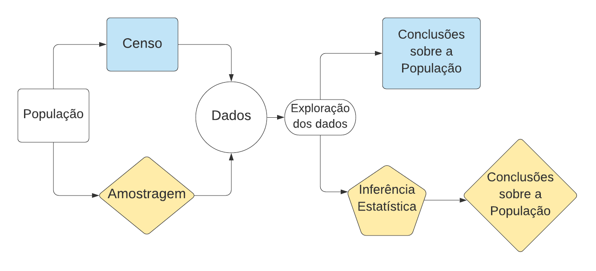

\newtheorem{exemplo}{Exemplo}
\newtheorem{assumption}{Assumption}
\renewcommand{\thesection}{\Alph{Seções}}

## Estatística: visão geral


```{r setup, include=FALSE}
knitr::opts_chunk$set(echo = TRUE)
```


```{r include=FALSE}
xfun::session_info(c(		'blogdown',	'bookdown',	'knitr',	'rmarkdown',	'htmltools',
		'reticulate',	'rticles',	'flexdashboard',	'learnr',	'shiny',
		'revealjs',	'pkgdown',	'tinytex',	'xaringan',	'tufte'
),	dependencies	=	FALSE)
```

A estatística consiste numa metodologia científica para obtenção, organização, redução, apresentação, análise e interpretação  de dados oriundos das mais variadas áreas das ciências experimentais, cujo objetivo principal é auxiliar a tomada de decisão em situações de incerteza, veja por exemplo @bussab e @barbetta2004. Informalmente, podemos definir a ciência estatística como um conjunto de técnicas utilizadas para estudar a condição de uma população usando informações obtidas a partir de dados observados.


<center>   __De onde vêm os dados?__ </center>
	
 
Dados são resultados de observações de algum fenômeno, podendo ser obtidos a partir de observações espontâneas  ou por meio de realização de  experimentos planejados. 
 
 
 
 
 

- Dados oriundos de observações de fenômenos quaisquer: 
     - observar o desempenho natural de um novo equipamento.

	
Nesse caso, o desempenho natural do equipamento é  a característica que se deseja estudar.


 * Dados oriundos de experimentos planejados: 
 -  observar o desempenho  de um novo  equipamento, alterando de modo proposital alguma característica.

	Nesse caso, o interesse é estudar  o desempenho do equipamento levando em consideração a variação da característica alterada.


		
A estatística, muitas vezes, é de grande utilidade quando o método científico é utilizado  para testar teoria ou hipóteses em muitas áreas do conhecimento. Esse método pode ser resumido nos seguintes passos.

* Um problema é formulado em que, muitas vezes, uma hipótese precisa ser testada.

	* Para solucionar o problema, deve-se coletar informações que sejam relevantes, para isso pode-se formular um experimento. Em muitas áreas do conhecimento o planejamento do experimento não é simples, ou até mesmo não é possível, e uma estratégia pode ser a observação de algum fenômeno  de interesse.	
	
*	Os resultados do experimento podem ser utilizados para se obter conclusões, definitivas ou não.
*  Os passo 2 e 3 podem ser repetidos quantas vezes forem necessárias.


```{example}
Ao observar um equipamento que deveria estar operando, nota-se que este está parado.

- Hipotese: falta de energia elétrica.

- Faz-se a observação para verificar a hipótese

- Se não é falta de energia, outras observações e testes serão requeridos.

- Os passos serão executados até que se tenha uma conclusão, que pode ser definitiva ou não.
		
```

	
		

Muitas vezes, na aplicação do método científico a estatística é uma ferramenta  indispensável, podendo ser requerida em todas as etapas.


```{example}
	Ao observar um equipamento em operação, desconfia-se que este não está operando como deveria.

* Hipótese: o equipamento está desregulado, neste caso pode-se optar por realizar um processo de amostragem de produtos fabricados pela máquina, então faz-se necessário o planejamento de um experimento para coleta das amostras (área da estatística).

* Após o planejamento, o experimento é realizado e ferramentas da estatística podem ser aplicadas para obter alguma conclusão.

* Caso os resultados sejam inconclusivos, novos experimentos poderão ser realizados.

* Os passos podem ser executados até que se tenha uma conclusão.
```


### Planejamento da Análise

	
É nessa estapa que deve ser delimitada a __população__ de interesse, ou seja deve ser feita a __formulação do problema, definindo sua abrangência__.


 Em uma análise estatística, a população pode ser pensada como o conjunto que contém todos os indivíduos, fenômenos ou resultados que se pretende investigar, sendo bem delimitado por pelo menos uma característica compartilhada por todos os seus elementos. 


Após defini-la, ainda deve ser decidido se é possível ou viável obter os dados a partir de toda a população de interesse ou de parte dela. Muitas vezes a análise é feita a partir de __amostras__ desta população.


```{definition, pyth, name="Amostra"}
É qualquer subconjunto da população que se deseja investigar.
```


Uma vez que foram observados os valores da variável de interesse (característica de interesse dos elementos da população) deve-se realizar uma crítica dos valores obtidos. Pois, muitas vezes, os dados contêm valores não realísticos, fruto de erros de digitações ou observações. Esses valores devem ser retificados ou excluídos da análise, pois poderão comprometer a confiabilidade dos resultados. Além disso, os dados devem ser estruturados de forma a facilitar a análise pretendida. Geralmente os dados são organizados em planilhas, mas dependendo de o quão grande seja o conjunto, ou banco, de dados, uma estruturação mais robusta pode ser requerida.


Essa é uma das etapas mais importante da análise estatística. Uma vez já feita a crítica dos valores, técnicas de uma divisão da estatística chamada  __Estatística Descritiva__ podem ser usadas para resumir, visualizar, analisar e interpretar os dados. Caso os dados sejam provenientes de amostras, é nesta fase que se busca compreender os dados, tirando informações que podem ser úteis na escolha das ferramentas estatísticas a serem utilizadas na fase posterior, na Inferência Estatística.

Nesta etapa, busca-se descrever o comportamento de uma população por meio de amostras, usando para isto modelos probabilísticos. Por esta razão, faz-se necessário o entendimento das teorias de probabilidades, que é um ramo da matemática que busca quantificar a incerteza envolvida em fenômenos que envolvem aleatoriedade. 


Após a definição do problema, em que a população e a variável de interesse são definidas, em uma análise estatística, pode-se pensar nas etapas descritas na Figura \@ref(fig:diagram), que mostra de forma esquemática e resumida as possíveis etapas de uma análise estatística, quando já está definida qual é a população de interesse. Note que existem casos em que apenas uma análise descritiva (exploratória) dos dados é suficiente para tirar conclusões a respeito da população de interesse. No entanto, se a população é maior do que o conjunto de unidades amostrais utilizadas para a obtenção dos dados, sob determinadas condições, podemos fazer uso das teorias de probabilidades para fazer inferência sobre as características desejadas da população (os parâmetros de interesse).

<center> 


```{r include=FALSE}
library(ggplot2)
library(dplyr)
```


```{r diagram,  echo=FALSE, fig.align = 'center', out.width = "90%", fig.cap = "Análise estatística  a partir de amostra ou de população."}

```


```{r diagrama, eval=FALSE, fig.cap=, include=FALSE}
library(DiagrammeR)
grViz("digraph flowchart{
    node [fontname = Helvetica, shape = oval]           
      
      tab1 [label = '@@1']
      tab2 [label = '@@2']
      tab3 [label = '@@3']
      tab4 [label = '@@4']
      tab5 [label = '@@5']
      tab6 [label = '@@6']
      tab7 [label = '@@7']
      tab8 [label = '@@8']
      tab9 [label = '@@9']
         

      # edge definitions with the node 
       tab2 -> tab1 -> tab9 -> tab8 -> tab6;
      tab2 -> tab3 -> tab4 -> tab7 -> tab5 -> tab6
      }
      [1]: 'Censo'
      [2]: 'População'
      [3]: 'Amostragem'
      [4]: 'Amostra observada (dados)'
      [5]: 'Inferência Estatística (uso de probabilidades)' 
      [6]: 'Conclusões sobre a população' 
      [7]: 'Informações extraídas dos dados' 
      [8]: 'Exploração dos dados' 
      [9]: 'Observações (dados)' 
       
            ")
```

</center> 

Em uma análise estatística, independentemente de que seja utilizada uma amostra ou a população inteira para obter o conjunto de observações,  uma analise exploratória dos dados fazendo uso de ferramentas da \textbf{estatística descritiva} é sempre requerida. Embora essa analise inicial ocorra de forma semelhante para população ou amostra, aqui são utilizadas notações diferentes para indicar se as ferramentas estão sendo aplicadas a dados oriundos de amostras ou de populações.


De um modo geral, todas as etapas requeridas para uma análise completa deve ser trabalhada com muito cuidado a fim de que sejam utilizadas as ferramentas adequadas para solução do problema que se deseja resolver, pois a adequação das ferramentas estatísticas apo problema irá conduzir a resultados mais confiáveis, que podem ser usados com mais confiança na solução do problema que se deseja resolver.


## Referencias

